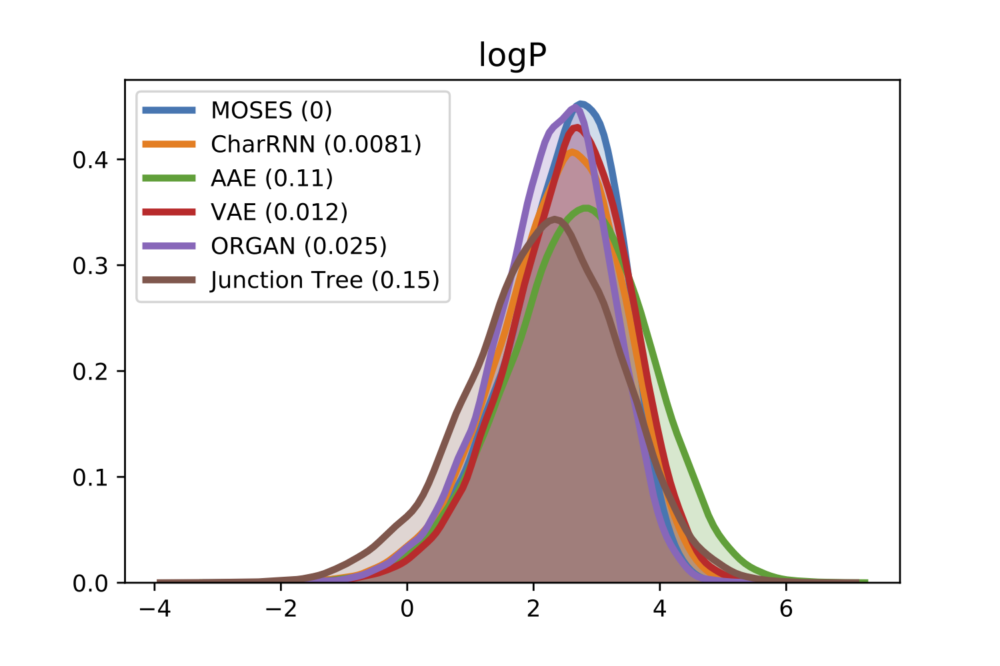
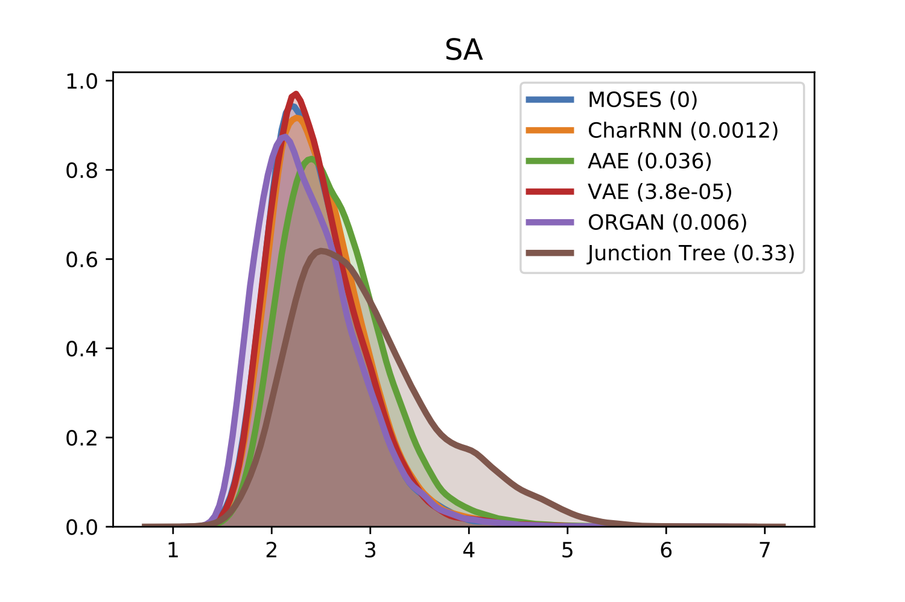
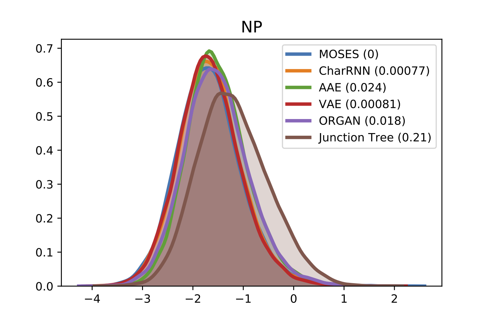
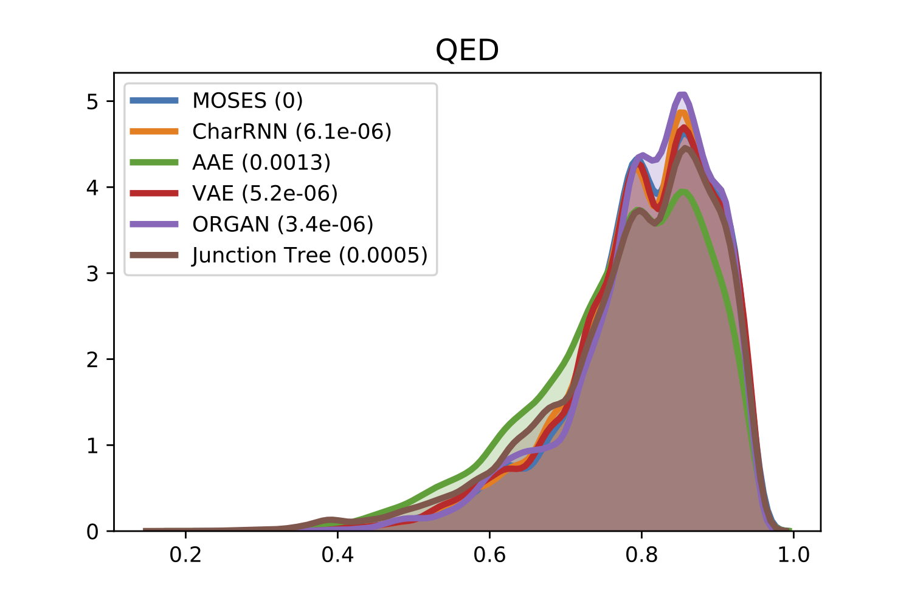
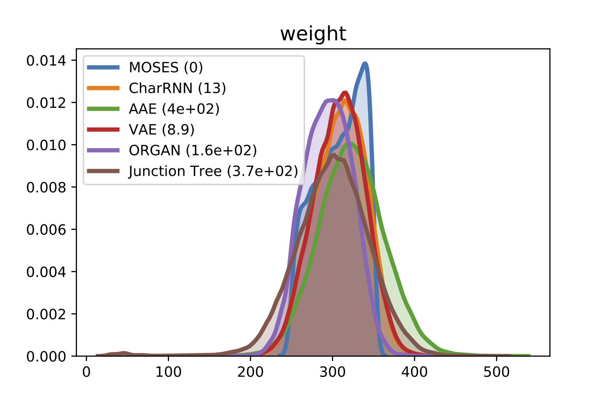

# Molecular Sets (MOSES): A benchmarking platform for molecular generation models

Deep generative models such as generative adversarial networks, variational autoencoders, and autoregressive models are rapidly growing in popularity for the discovery of new molecules and materials. In this work, we introduce MOlecular SEtS (MOSES), a benchmarking platform to support research on machine learning for drug discovery. MOSES implements several popular molecular generation models and includes a set of metrics that evaluate the diversity and quality of generated molecules. MOSES is meant to standardize the research on molecular generation and facilitate the sharing and comparison of new models. Additionally, we provide a large-scale comparison of existing state of the art models and elaborate on current challenges for generative models that might prove fertile ground for new research. Our platform and source code are freely available here.

__For more details, please refer to the [paper](images/Molecular_Sets__MOSES___A_Benchmarking_Platform_for_Molecular_Generation_Models.pdf).__


## Dataset

We propose a biological molecule benchmark set refined from the ZINC database.

The set is based on the ZINC Clean Leads collection. It contains 4,591,276 molecules in total, filtered by molecular weight in the range from 250 to 350 Daltons, a number of rotatable bonds not greater than 7, and XlogP less than or equal to 3.5. We removed molecules containing charged atoms or atoms besides C, N, S, O, F, Cl, Br, H or cycles longer than 8 atoms. The molecules were filtered via medicinal chemistry filters (MCFs) and PAINS filters.

The dataset contains 1,936,962 molecular structures. For experiments, we also provide a training, test and scaffold test sets containing 250k, 10k, and 10k molecules respectively. The scaffold test set contains unique Bemis-Murcko scaffolds that were not present in the training and test sets. We use this set to assess how well the model can generate previously unobserved scaffolds.

## Models

* [Character-level Recurrent Neural Network (CharRNN)](./moses/char_rnn/README.md)
* [Variational Autoencoder (VAE)](./moses/vae/README.md)
* [Adversarial Autoencoder (AAE)](./moses/aae/README.md)
* [Objective-Reinforced Generative Adversarial Network (ORGAN)](./moses/organ/README.md)
* [Junction Tree Variational Autoencoder (JTN-VAE)](./moses/junction_tree/README.md)

## Metrics
Besides standard uniqueness and validity metrics, MOSES provides other metrics to access the overall quality of generated molecules. Fragment similarity (Frag) and Scaffold similarity (Scaff) are cosine distances between vectors of fragment or scaffold frequencies correspondingly of the generated and test sets. Nearest neighbor similarity (SNN) is the average similarity of generated molecules to the nearest molecule from the test set. Internal diversity (IntDiv) is an average pairwise similarity of generated molecules. Fréchet ChemNet Distance (FCD) measures the difference in distributions of last layer activations of ChemNet.

<table border="1" class="dataframe">
  <thead>
    <tr style="text-align: right;">
      <th rowspan="2">Model</th>
      <th rowspan="2">Valid (↑)</th>
      <th rowspan="2">Unique@1k (↑)</th>
      <th rowspan="2">Unique@10k (↑)</th>
      <th colspan="2">FCD (↓)</th>
      <th colspan="2">SNN (↓)</th>
      <th colspan="2">Frag (↑)</th>
      <th colspan="2">Scaff (↑)</th>
      <th rowspan="2">IntDiv (↑)</th>
      <th rowspan="2">Filters (↑)</th>
    </tr>
    <tr>
      <th>Test</th>
      <th>TestSF</th>
      <th>Test</th>
      <th>TestSF</th>
      <th>Test</th>
      <th>TestSF</th>
      <th>Test</th>
      <th>TestSF</th>
    </tr>
  </thead>
 <tbody>
    <tr>
      <th>CharRNN</th>
      <td>0.9598</td>
      <td><b>1.0000</b></td>
      <td>0.9993</td>
      <td>0.3233</td>
      <td>0.8355</td>
      <td>0.4606</td>
      <td>0.4492</td>
      <td>0.9977</td>
      <td>0.9962</td>
      <td>0.7964</td>
      <td>0.1281</td>
      <td><b>0.8561</b></td>
      <td>0.9920</td>
    </tr>
    <tr>
      <th>VAE</th>
      <td>0.9528</td>
      <td><b>1.0000</b></td>
      <td>0.9992</td>
      <td><b>0.2540</b></td>
      <td><b>0.6959</b></td>
      <td>0.4684</td>
      <td>0.4547</td>
      <td><b>0.9978</b></td>
      <td><b>0.9963</b></td>
      <td><b>0.8277</b></td>
      <td>0.0925</td>
      <td>0.8548</td>
      <td>0.9925</td>
    </tr>
    <tr>
      <th>AAE</th>
      <td>0.9341</td>
      <td><b>1.0000</b></td>
      <td><b>1.0000</b></td>
      <td>1.3511</td>
      <td>1.8587</td>
      <td>0.4191</td>
      <td>0.4113</td>
      <td>0.9865</td>
      <td>0.9852</td>
      <td>0.6637</td>
      <td><b>0.1538</b></td>
      <td>0.8531</td>
      <td>0.9759</td>
    </tr>
    <tr>
      <th>ORGAN</th>
      <td>0.8731</td>
      <td>0.9910</td>
      <td>0.9260</td>
      <td>1.5748</td>
      <td>2.4306</td>
      <td>0.4745</td>
      <td>0.4593</td>
      <td>0.9897</td>
      <td>0.9883</td>
      <td>0.7843</td>
      <td>0.0632</td>
      <td>0.8526</td>
      <td><b>0.9934</b></td>
    </tr>
    <tr>
      <th>JTN-VAE</th>
      <td><b>1.0000</b></td>
      <td>0.9980</td>
      <td>0.9972</td>
      <td>4.3769</td>
      <td>4.6299</td>
      <td><b>0.3909</b></td>
      <td><b>0.3902</b></td>
      <td>0.9679</td>
      <td>0.9699</td>
      <td>0.3868</td>
      <td>0.1163</td>
      <td>0.8495</td>
      <td>0.9566</td>
    </tr>
  </tbody>
</table>

For comparison of molecular properties, we computed the Frèchet distance between distributions of molecules in the generated and test sets. Below, we provide plots for lipophilicity (logP), Synthetic Accessibility (SA), Quantitative Estimation of Drug-likeness (QED), Natural Product-likeness (NP) and molecular weight.

|logP|SA|
|----|--|
|||
|NP|QED|
|||
|weight|
||

### Calculation of metrics for all models

You can calculate all metrics with:
```
cd scripts
python run.py 
```
If necessary, dataset will be downloaded, splited and all models will be trained. As result in current directory will appear `metrics.csv` with values.
For more details use `python run.py --help`.

## Installation
* [Install RDKit](https://www.rdkit.org/docs/Install.html) for metrics calculation.
* Install models with `python setup.py install`

## Usage

### Training of model
You can train model with:
```
cd scripts/<model name>
python train.py --train_load <path to train dataset> --model_save <path to model> --config_save <path to config> --vocab_save <path to vocabulary>
```
For more details use `python train.py --help`.

### Calculation of metrics for trained model
You can calculate metrics with:
```
cd scripts/<model name>
python sample.py --model_load <path to model> --config_load <path to config> --vocab_load <path to vocabulary> --n_samples <number of smiles> --gen_save <path to generated smiles>
cd ../metrics
python eval.py --ref_path <path to referenced smiles> --gen_path <path to generated smiles>
```
All metrics output to screen.
For more details use `python sample.py --help` and `python eval.py --help`.

You also can use `python run.py --model <model name>` for calculation metrics.
