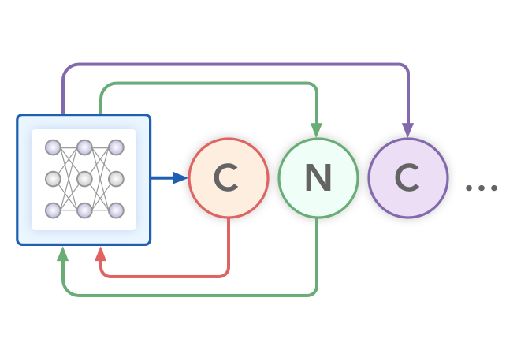

# Char-RNN

Character-level recurrent neural networks (CharRNN) [1] treats the task of generating SMILES as a language model attempting to learn the statistical structure of SMILES syntax by training it on a large corpus of SMILES. Model parameters are optimized using maximum likelihood estimation (MLE). CharRNN is implemented using Long Short-Term Memory RNN cells stacked into three layers with hidden dimension 600 each. To prevent overfitting, a dropout layer is added between intermediate layers with dropout probability of 0.2. Softmax is utilized as an output layer. Training is done with a batch size of 64, using the Adam75 optimizer with a learning rate of 10-3 for 50 epochs.

## Links

[1] [Generating Focused Molecule Libraries for Drug Discovery with Recurrent Neural Networks] https://pubs.acs.org/doi/full/10.1021/acscentsci.7b00512
